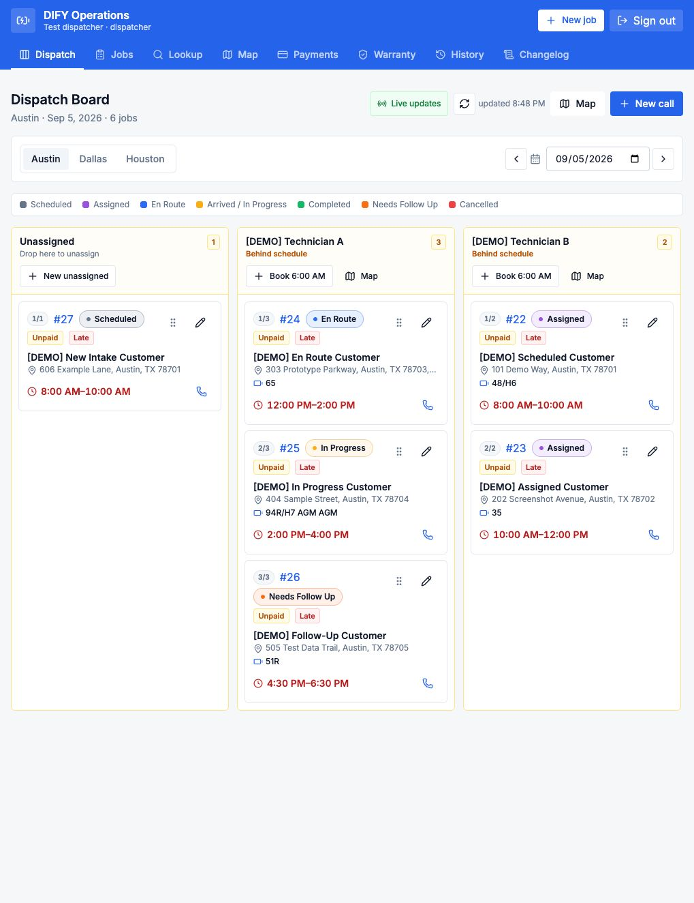
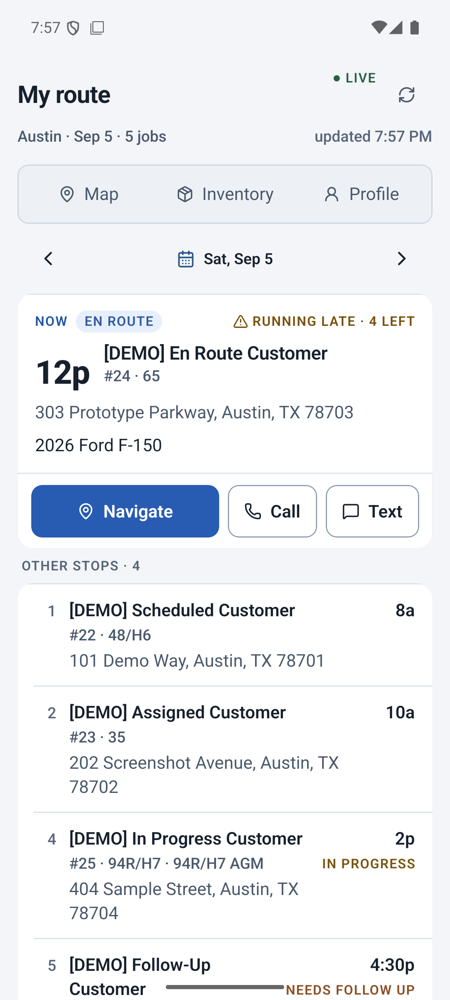
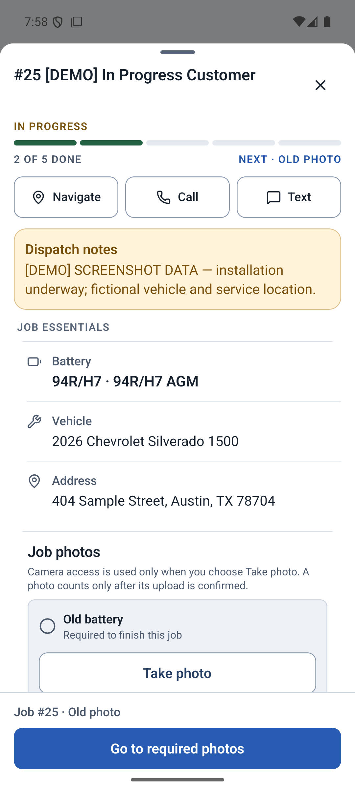

# DIFY Battery Operations Platform

I'm building a web platform and mobile app for DIFY Battery, a mobile vehicle-battery replacement company. Dispatchers use the website to manage calls, quotes, and assignments. Technicians use the app to view jobs, document installations, and handle checkout.

**Developer:** [Noah Serrault](https://www.linkedin.com/in/noah-serrault-549a56252/) · Sole software developer

This repository documents the project with screenshots and an engineering overview. The application source and company data are private.

[View the website and app screenshots](docs/WALKTHROUGH.md)

## Why I built it

I worked in DIFY's field operations and helped launch its Austin market before college. I returned as the company's sole software developer while studying Data Science at the University of Wisconsin–Madison.

Having done the field work, I wanted to make the information needed for each job easier to find. The project brings together tasks spread across several SaaS tools, including battery selection, quoting, scheduling, and service records. The vehicle-to-battery fitment workflow is also intended to help new dispatchers learn which batteries a vehicle needs.

## What it does

| Area | Features |
| --- | --- |
| Intake and quoting | Customer details, vehicle and battery lookup, catalog recommendations, and itemized estimates. |
| Scheduling and dispatch | Technician assignments, appointment windows, job status, and route planning. |
| Technician app | Assigned jobs, service instructions, installation photos, field updates, and checkout. |
| Service records | Job history, photos, warranty information, and audit records. |
| Integrations | Square payments, Twilio messaging, and Google Maps. |

### My role

I'm responsible for the web and mobile applications, backend APIs, database design, integrations, and automated tests. My previous work as a technician helps me make decisions about the information and controls people need on each screen.

## Backend work

- PostgreSQL functions handle pricing and business-critical job changes for both applications.
- Role checks and row-level security restrict access to job data. Installation photos are stored privately.
- Square webhooks and scheduled reconciliation match confirmed payments to service jobs.
- Idempotency keys protect against duplicate operations when requests are retried. An outbox handles retries for external services.
- Mobile queues retain pending updates when a technician loses connectivity. The backend validates those updates when they arrive.
- Vitest and Playwright cover unit and browser tests, with separate checks for the native app.

The [engineering overview](docs/ENGINEERING.md) explains these decisions in more detail.

## Native app

The technician app shows the day's stops, dispatcher notes, vehicle details, and required installation photos.

  
  

Screenshots were taken on staging and an Android emulator on September 8, 2026. They use fictional customers and service locations. See the [full walkthrough](docs/WALKTHROUGH.md) for more views and capture notes.

## Technology

| Layer | Technologies |
| --- | --- |
| Web | Next.js, React, TypeScript |
| Mobile | React Native, Expo |
| Backend and data | Next.js server-side APIs, PostgreSQL, Supabase Auth / Storage / Realtime |
| Integrations | Square, Twilio, Google Maps |
| Testing and monitoring | Vitest, Playwright, Sentry |
| Delivery and version control | Vercel, Git, GitHub Actions |

## Contact

[LinkedIn](https://www.linkedin.com/in/noah-serrault-549a56252/) · [GitHub](https://github.com/noahserrault)

You can reach me on LinkedIn to discuss the project or arrange a walkthrough.
