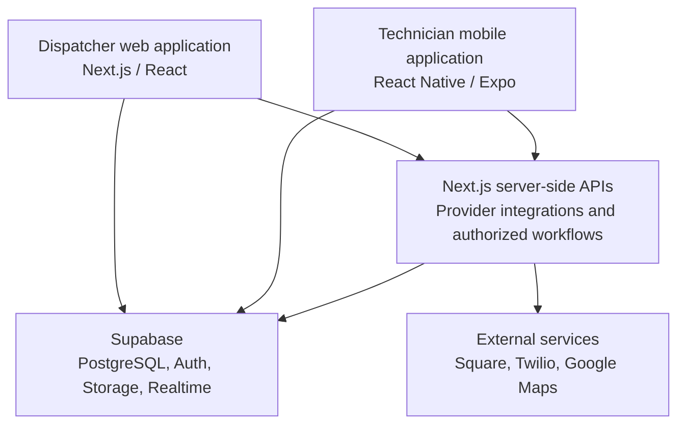

# Engineering overview

[Back to the project overview](../README.md)

## Architecture

The Next.js website and React Native app share a Next.js and Supabase backend. Dispatchers work at a desk, while technicians need access to the same job information in the field.

Clients access Supabase with authenticated, permission-scoped sessions. Pricing and payment state are controlled by the backend. Native checkout also uses Square's mobile SDK.

## Database rules

PostgreSQL functions handle pricing and business-critical job changes. Keeping those rules in the database avoids maintaining separate versions for the website and mobile app. Transactions and database constraints help keep records consistent when dispatchers and technicians work on the same job.

## Payment reconciliation

The backend uses verified Square events and reconciliation results to determine payment status. It matches payments to service jobs and keeps records for review. A successful response on the technician's screen alone does not mark a job as paid.

## Interrupted connections

Technicians often work in garages and parking structures with poor reception. The app queues pending updates, and the backend uses idempotency keys to avoid repeating an operation when a request is retried. External-service requests are handled through an outbox so they can be retried separately from the original database change. Payment processing is not covered by this offline behavior.

## Access and audit records

Role checks and row-level security limit access to operational data. Installation photos are stored privately and require authorized access. Audit records track changes to jobs so staff can review what happened.

## Testing

I use Vitest for unit tests and Playwright for browser tests. Native checks are separate because browser tests cannot establish whether camera access, location, or Square's payment SDK work on a device. The project is still undergoing staging and device testing.

## Public repository

This repository contains documentation and demo screenshots. Application code, company records, credentials, and internal deployment instructions remain private.
