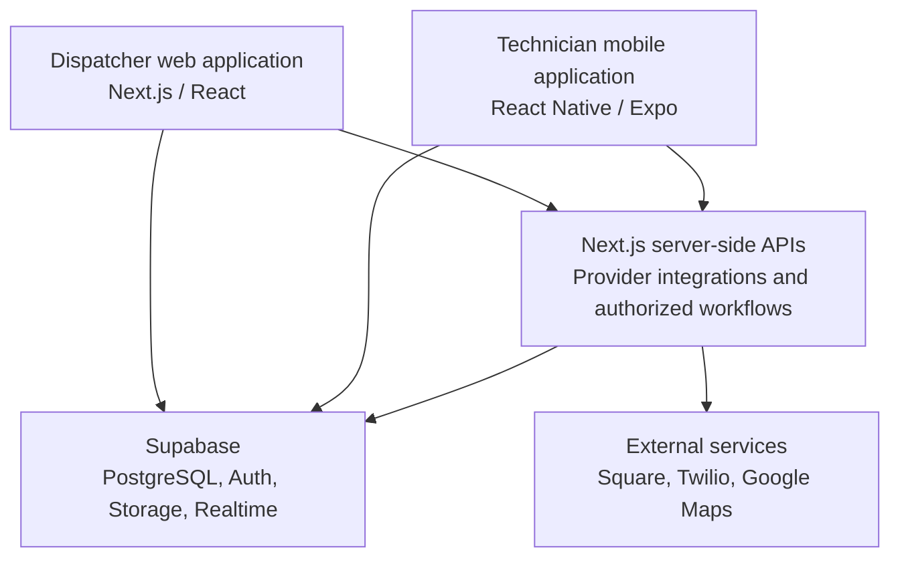

# Engineering overview

[Back to the project overview](../README.md)

## One backend for two working environments

Dispatchers work in a desktop web interface. Technicians use a native application in the field. Both rely on the same backend and database rules.

This is a high-level component view, not an exhaustive network diagram. Client access to Supabase is authenticated and permission-scoped; it does not make clients authoritative for pricing or payment state. Native checkout also uses Square's mobile SDK, with platform-specific device validation required.

## Selected design decisions

### Keep business rules consistent across clients

A dispatcher quote and a technician's view of the same job should not depend on separately maintained pricing implementations. Pricing and business-critical job changes are handled in PostgreSQL. Transactional operations and database constraints support consistency when multiple users act on the same workflow.

### Treat external payments as asynchronous

The mobile interface is not the final authority on whether money moved. The backend processes verified provider events and reconciliation results, associates them with service jobs, and retains records for review. This separates the checkout experience from the accounting of its eventual outcome.

### Expect retries and interrupted connections

Field work can involve garages, parking structures, and inconsistent reception. Queued mobile work and idempotent backend commands address interrupted requests. Outbox processing supports retrying external side effects separately from the original database change. This does not imply that every feature, particularly payment processing, works offline.

### Protect operational records

Role checks and row-level security limit who can read or change data. Service-photo access is authorized and storage is private. Audit records help explain operational changes without relying solely on what a client currently displays.

### Match testing to the actual runtime

Unit and browser tests cover different behavior from native-device checks. Camera, location, reader connectivity, and native checkout require their own validation. The existence of an integration or test suite is not a claim of complete production or cross-platform certification.

## Scope of this public repository

This repository intentionally contains only portfolio documentation and, once reviewed, demonstration media. It does not include application source, database exports, internal runbooks, customer records, environment configuration, or deployment access.
