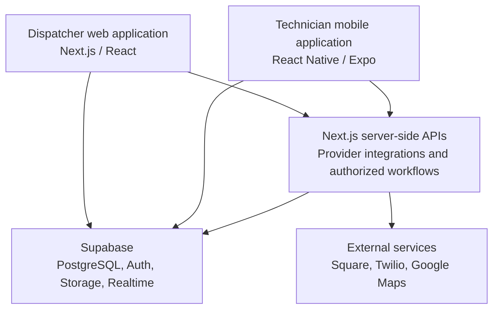

# Engineering overview

[Back to the project overview](../README.md)

## Architecture

The Next.js website and React Native app share a Next.js and Supabase backend. Dispatchers work at a desk, while technicians need access to the same job information in the field.

Clients access Supabase with authenticated, permission-scoped sessions. Pricing and payment state are controlled by the backend. Native checkout also uses Square's mobile SDK.

## From requirements to a working MVP

I started the project with a plain-text product and implementation brief. It described the real field workflow, product goals and non-goals, user roles, job states, major screens, proposed data model, phased delivery plan, and acceptance tests. That written brief was the product source of truth for the original MVP.

The first version deliberately optimized for learning: it ran locally, used SQLite, and simulated external providers. It was still a complete vertical slice across dispatcher intake, scheduling, technician execution, required photos, inventory, payment records, and warranties. Building that version exposed the operational rules that mattered before I committed to production infrastructure.

I then migrated the application in place instead of discarding it. The production design retained the validated workflows and moved persistence, authorization, files, realtime updates, and integrations to Supabase and server-side provider adapters. This separated two questions that are easy to conflate: whether the product workflow is useful, and whether the implementation is ready to operate safely.

## Database rules

PostgreSQL functions handle pricing and business-critical job changes. Keeping those rules in the database avoids maintaining separate versions for the website and mobile app. Transactions and database constraints help keep records consistent when dispatchers and technicians work on the same job.

## Payment reconciliation

The backend uses verified Square events and reconciliation results to determine payment status. It matches payments to service jobs and keeps records for review. A successful response on the technician's screen alone does not mark a job as paid.

## Interrupted connections

Technicians often work in garages and parking structures with poor reception. The app queues pending updates, and the backend uses idempotency keys to avoid repeating an operation when a request is retried. External-service requests are handled through an outbox so they can be retried separately from the original database change. Payment processing is not covered by this offline behavior.

## Access and audit records

Role checks and row-level security limit access to operational data. Installation photos are stored privately and require authorized access. Audit records track changes to jobs so staff can review what happened.

## Development standards and AI-assisted workflow

I created the project's working agreements and documentation structure as the system grew. Version-controlled materials cover architecture decisions, development setup, delivery phases, acceptance criteria, security-sensitive contracts, known defects, release checklists, and verification evidence. A change is not considered complete because it compiles or looks correct in a browser; its behavior must match the documented requirement and pass the relevant gates.

AI coding tools help me explore designs, implement bounded changes, generate test cases, and review unfamiliar surfaces. I validate their output by inspecting the actual diff, checking assumptions against the repository and provider documentation, and running the appropriate automated and manual tests. Authentication, payments, and privileged database behavior receive stricter treatment: observable invariants are written first, implementation and review are separated, and negative or abuse cases are tested explicitly.

The default is the smallest change that satisfies the requirement. New abstractions or services need a concrete reason, unrelated refactors stay out of feature work, and escaped defects are turned into regression tests or stronger tooling.

## CI/CD and testing

GitHub Actions runs on pushes and pull requests. Work is divided into independent jobs so failures identify the affected surface instead of hiding behind one broad script:

| Pipeline area | Validation |
| --- | --- |
| Web and shared code | Contract integrity, ESLint, TypeScript, Vitest, production build, and dependency policy. |
| Mobile source | React Native lint and type checks plus focused suites for configuration, auth, photos, location, checkout, completion, offline mutations, route maps, and day planning. |
| Android artifact | Debug APK compilation followed by package, manifest, configuration, archive-integrity, and checksum inspection. |
| Database and APIs | A fresh local Supabase stack, migrations, schema linting, generated-type drift detection, integration tests, and a 100-job load simulation. |
| Browser E2E | Playwright journeys covering dispatcher and technician workflows, offline behavior, charging, and payment operations against synthetic data. |
| Security | Dependency, secret, static-analysis, and CodeQL workflows, with high-severity dependency findings treated as failures unless explicitly reviewed. |

The release gate requires both web and mobile source jobs to succeed. Failed, skipped, or cancelled source checks cannot produce a green release result. Test environments reject remote database targets for destructive integration and browser suites, which helps prevent synthetic fixtures or resets from reaching staging or production.

Staging is isolated in separate Vercel and Supabase projects. Deployment is intentionally controlled rather than inferred from a green build: environment configuration, database migrations, provider settings, rollback steps, and the exact release candidate still need to be verified. This distinguishes continuous integration from proof that a particular deployment is healthy.

Vitest covers unit and integration behavior, while Playwright verifies complete browser journeys. Native checks remain separate because browser automation and mocked components cannot establish that camera access, location services, backgrounding, or Square's native SDK work on an installed device. Those capabilities require emulator or device evidence in addition to CI.

## Public repository

This repository contains documentation and demo screenshots. Application code, company records, credentials, and internal deployment instructions remain private.
