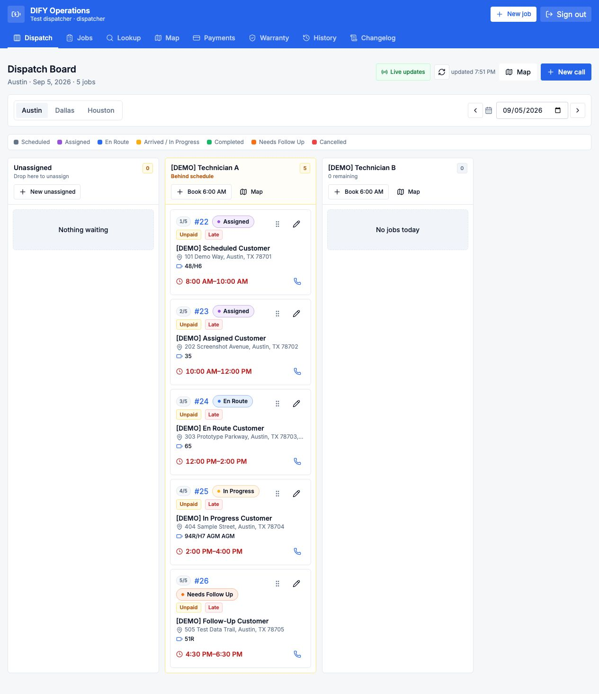

# Web and native-app walkthrough

[Project overview](../README.md) · [Engineering overview](ENGINEERING.md)

Actual screenshots captured September 8, 2026, from the DIFY staging website and its connected native Android sandbox app on a Pixel 8 emulator. Customers, service locations, and technicians shown in these captures are synthetic demonstration records. Click an image to inspect it at full size.

## 1. Compare service jobs

The jobs view brings status, customer and service-location details, appointment windows, technician assignment, and payment summaries into one searchable table. This capture is filtered to the five tagged demonstration jobs.

## 2. Coordinate dispatch

The dispatch board groups work by technician and exposes job status and appointment windows. The historical demo date intentionally preserves the existing records; overdue indicators reflect that date rather than live customer operations.

View dispatcher board

## 3. Prepare intake and a recommended quote

The intake interface combines customer and location details, vehicle selection, technician availability, and a catalog-based recommended estimate. This example uses a fictional customer and address, with a selected battery item and itemized taxes and fees. It was not submitted as a new job.

Vehicle selection and catalog selection are separate steps in this captured workflow; the screenshot does not imply automatic compatibility approval. The application also has a separate battery-fitment lookup view.

View intake and recommended quote

## 4. Plan a technician's route

The planning map connects numbered stops with the technician's appointment sequence and estimated drive times. Lines show stop order, not turn-by-turn roads. Live technician GPS is hidden for this historical demonstration date.

View planning map and stop sequence

## 5. Keep service details together

Staff can open the same job to review its vehicle, battery item, service address, schedule, and technician. This viewport capture shows the upper portion of an in-progress synthetic service record.

View staff service record

## 6. Support technicians in the field

The native application shows the current stop and the rest of the route, then opens a job sheet with dispatcher notes, vehicle and battery details, and installation documentation requirements.

  
  
  

The photo interface makes required documentation visible alongside the service price and payment entry point. Empty photo slots are intentional: no installation photos were staged or uploaded during this capture session, and checkout was not initiated.

## Capture scope

- Reused five existing tagged demo jobs dated September 5; no reseeding, deletion, reassignment, rescheduling, or job-status changes were performed.
- Filled an unsaved intake form with synthetic values; no additional service job was created.
- Used the installed Android sandbox app, version 1.0.0, updated September 4. Screenshots show that installed build, not an unbuilt working-tree revision or iOS behavior.
- Excluded a separate completed checkout-test record from public screenshots.
- Did not place calls, send messages, take payments, upload photos, or enable location tracking. Ordinary app authentication and read-side map/cache behavior are outside a claim of zero backend activity.
- These screenshots demonstrate interface scope. They do not certify production rollout, payment processing, offline synchronization, or complete end-to-end acceptance.

The [capture checklist](SCREENSHOT_PLAN.md) remains available for future updates and a short video walkthrough.
