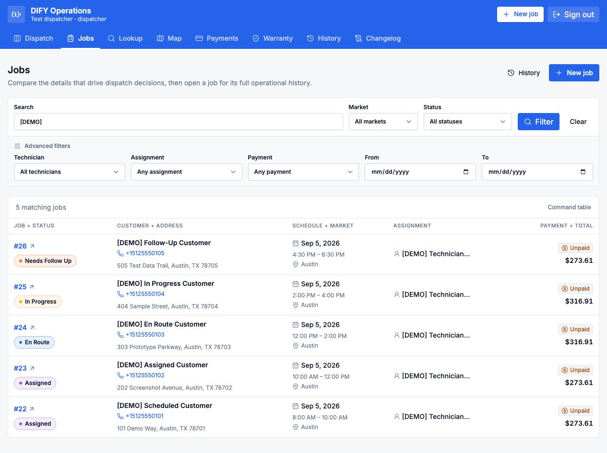
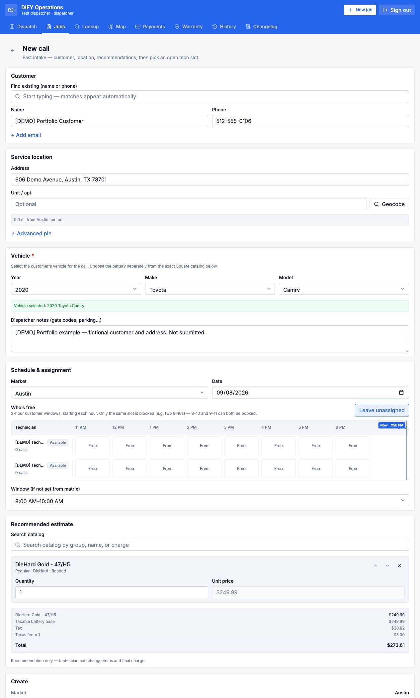
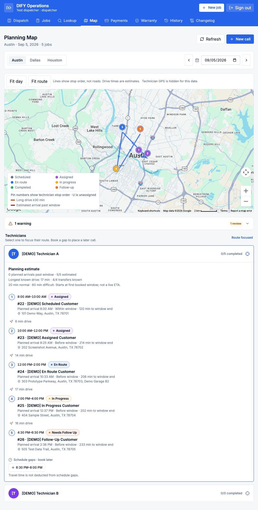
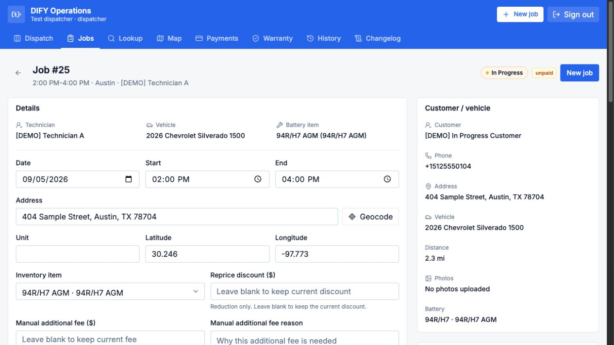
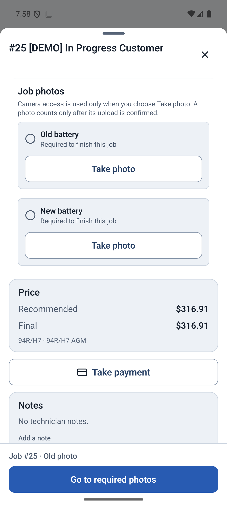

# Web and native-app walkthrough

[Project overview](../README.md) · [Engineering overview](ENGINEERING.md)

These screenshots show the DIFY staging website and Android sandbox app on a Pixel 8 emulator. They were taken on September 8, 2026, using fictional customers, service locations, and technicians. Prices are demo examples, not advertised rates.

## Jobs

Dispatchers can compare job status, appointments, assignments, and payment information in one searchable table. This view is filtered to five demo jobs.

## Dispatch board

The board groups jobs by technician and shows their status and appointment windows. This refreshed capture shows three calls assigned to Technician A, two to Technician B, and one new intake awaiting assignment. These demo jobs are dated September 5, which is why they appear overdue.

View dispatcher board

## Intake and quoting

Dispatchers enter the customer, location, and vehicle, check technician availability, and select a battery from the catalog. The estimate includes taxes and fees. This example was filled out for the screenshot and not saved.

Vehicle selection and catalog selection are separate steps here. Battery-fitment guidance is also available in the lookup view.

View intake and recommended quote

## Route planning

The map shows stop order, appointment windows, and estimated drive times. Lines connect the stops rather than following roads. Live GPS is hidden when viewing a past date.

View planning map and stop sequence

## Service records

Opening a job shows its vehicle, battery, service address, schedule, and assigned technician. This screenshot shows the top of an in-progress demo job.

View staff service record

## Technician app

Technicians can see their current stop and the rest of the day's route. Opening a job brings up dispatcher notes, vehicle and battery details, and required photos.

  
  
  

The job sheet includes slots for old and new battery photos, pricing, and a checkout button. No photos were uploaded or payments taken for these screenshots.

## Capture notes

- Existing demo records were reused without changing their assignments, schedules, or status.
- The Android screenshots show the installed sandbox app, version 1.0.0, updated September 4.
- No customer calls, messages, payments, or photo uploads were made. Location tracking was not enabled.
- These are interface examples, not a record of completed production, payment, or offline testing.

The [capture checklist](SCREENSHOT_PLAN.md) covers future screenshot updates and a short video.
